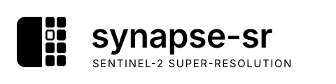

<p align="center">
  <picture>
    <source media="(prefers-color-scheme: dark)" srcset="assets/logo-wordmark-dark.svg">
    
  </picture>
</p>

<p align="center">
  Observation-consistent super-resolution of Sentinel-2 imagery from 10 m to a 2 m grid.
</p>

---

`synapse-sr` turns a Sentinel-2 L2A scene into a 2.0 m RGBN product that stays consistent with what the
satellite actually measured. The network adds only structure that the 10 m observation cannot see; everything
the sensor did observe is fixed by a physical model of Sentinel-2 and cannot be altered by the network.

Every result carries its own accounting: a per-pixel error-scale map, a support class that separates
observation-determined pixels from prior-dominated ones, and a measured round-trip consistency against the
input.

## Contents

- [How it works](#how-it-works)
- [Installation](#installation)
- [Quick start](#quick-start)
- [Examples](#examples)
- [Outputs](#outputs)
- [Input requirements and preprocessing](#input-requirements-and-preprocessing)
- [Performance](#performance)
- [Limitations](#limitations)
- [Development](#development)
- [Acknowledgements](#acknowledgements)

## How it works

```
x_hat = x_base + P_N(delta)
```

| Component | Role |
|---|---|
| `A` | Sentinel-2 forward operator: per-band point-spread function on a 0.5 m grid, sampled at source-pixel centres |
| `x_base` | Deterministic baseline: bicubic anchor corrected by Tikhonov regularisation, with the regularisation weight chosen per band so the residual matches the sensor noise level (Morozov discrepancy principle) |
| `delta` | Structural correction predicted by the network |
| `P_N` | Projector onto the null space of `A`: removes every component of `delta` the sensor could have observed |

Because `A P_N = 0`, the output reproduces the input observation exactly as well as `x_base` does, whatever
the network predicts. The network can add detail; it cannot contradict the measurement.

The network (`SynapseProX5`, 14.4 M parameters) uses:

- a state-space (Mamba) structural backbone of 6 residual groups x 8 visual state-space blocks with four-direction scanning;
- an RGBN spatial stem plus a gated context stem for the six 20 m bands (B05, B06, B07, B8A, B11, B12);
- a frequency-split feature mixer;
- a direct x5 PixelShuffle reconstruction head with ICNR initialisation, so that all 25 sub-pixel phases start identical and no 10 m cell pattern is imprinted.

Scale x5 is odd, so the centre 2 m sub-pixel of each 10 m pixel sits exactly on the source-pixel centre and
the output grid shares the input's origin.

## Installation

```bash
pip install git+https://github.com/SharadhNaidu/synapse-sr.git
```

Requirements: Python 3.8 or newer, PyTorch 1.13 or newer, `numpy`, `safetensors`, `rasterio`, `affine`.

Optional fast path on NVIDIA GPUs:

```bash
pip install "synapse-sr[cuda] @ git+https://github.com/SharadhNaidu/synapse-sr.git"
```

This installs the fused `mamba-ssm` selective-scan kernel. Without it, the package falls back to a pure
PyTorch implementation that matches the fused kernel to a relative error of 1.7e-7. The fallback is slower, but
the results are the same.

## Quick start

### Python

```python
from synapse import Pro

model = Pro.from_pretrained()                     # or Pro.from_pretrained(weights="synapse-pro-v1.safetensors")
result = model.super_resolve("sentinel2_l2a.tif")

result.image          # (4, 5H, 5W) reflectance, bands B04 B03 B02 B08, 2.0 m grid
result.confidence     # (4, 5H, 5W) predicted absolute error scale (reflectance)
result.support        # (5H, 5W) 2 = HIGH, 1 = MEDIUM, 0 = LOW / invalid input
result.consistency    # per-band RMS(A x_hat - y) / noise level
result.gsd            # 2.0

result.save("sentinel2_2m.tif")
```

### Command line

```bash
synapse-sr sentinel2_l2a.tif sentinel2_2m.tif
```

```
usage: synapse-sr [-h] [--weights WEIGHTS] [--model MODEL] [--device DEVICE]
                  [--scl SCL] [--offset OFFSET] [--tile TILE] [--no-confidence]
                  input output
```

The CLI prints a JSON summary with the output grid spacing, shape, round-trip consistency per band and the
scan backend that was used.

## Examples

### Offline / air-gapped use

Weights are downloaded once and verified by SHA-256. For machines without network access, copy the checkpoint
and pass it explicitly. Nothing else is fetched.

```python
model = Pro.from_pretrained(weights="/opt/models/synapse-pro-v1.safetensors", device="cuda")
```

```bash
synapse-sr scene.tif scene_2m.tif --weights /opt/models/synapse-pro-v1.safetensors --device cpu
```

The cache location defaults to `~/.cache/synapse`, or you can set it with `SYNAPSE_CACHE`.

### Cloud and shadow masking with the scene classification layer

```python
result = model.super_resolve("scene.tif", scl="scene_SCL_20m.tif")
result.valid                   # False where the input was NoData, cloud, cloud shadow, cirrus or saturated
result.metadata["invalid_input_fraction"]
```

SCL classes 0, 1, 3, 8, 9 and 10 are treated as invalid. A 20 m SCL raster is replicated onto the 10 m grid.
Invalid pixels are written as NaN in the saved GeoTIFF and assigned support class 0.

### Processing baseline 04.00 and later

L2A products from processing baseline 04.00 onward carry a radiometric offset of -1000 DN:

```bash
synapse-sr scene.tif scene_2m.tif --offset -1000
```

### In-memory arrays

```python
import numpy as np

stack = np.load("stack.npy")                        # (12, H, W) L2A in B01..B12 order (no B10), DN
result = model.super_resolve(stack)

named = model.super_resolve(arr10, band_names=["B04", "B03", "B02", "B08", "B05",
                                               "B06", "B07", "B8A", "B11", "B12"])
```

Accepted stacks are 10 bands in the order above, the 12-band L2A order, the 13-band L1C order, or any stack
whose band descriptions name the required bands.

### Separating what was observed from what was inferred

```python
observed = result.x_base      # determined by the Sentinel-2 measurement
inferred = result.prior       # structure supplied by the learned prior, invisible to the sensor
assert np.allclose(observed + inferred, result.image, atol=1e-5)

high = result.support == 2    # pixels whose content is essentially observation-determined
```

### Large scenes and arbitrary shapes

Scenes of any height and width are processed in overlapping tiles with a real-context halo, then assembled on
the output grid. The output is always exactly `5H x 5W`. The CRS is copied and the geotransform keeps the
input origin, so the output bounds equal the input bounds.

```python
result = model.super_resolve("large_scene.tif", tile=64, halo=16)
```

### Fetching a scene from a public STAC catalogue

`examples/stac_fetch.py` is a stand-alone helper. It is not a package dependency. It downloads a Sentinel-2
L2A subset, writes a SYNAPSE-ready 10-band GeoTIFF with band descriptions plus the SCL layer, and prints the
command to run.

```bash
pip install pystac-client
python examples/stac_fetch.py 77.59 12.97 2025-01-01 2025-02-28 bengaluru.tif --half 2000
synapse-sr bengaluru.tif bengaluru_2m.tif --scl bengaluru_scl.tif --offset -1000
```

## Outputs

`Result.save()` writes a float32 GeoTIFF with named bands:

| Band | Description |
|---|---|
| 1-4 | `B04`, `B03`, `B02`, `B08` surface reflectance on the 2.0 m grid |
| 5-8 | `ERRSCALE_B04` ... `ERRSCALE_B08`: predicted absolute error scale |
| 9 | `SUPPORT`: 2 HIGH, 1 MEDIUM, 0 LOW or invalid input |

Pass `with_confidence=False` (or `--no-confidence` on the command line) to write the four reflectance bands only.

Support classes are derived from the magnitude of the prior's contribution relative to the per-band sensor
noise level. Below 3 noise units a pixel is HIGH; between 3 and 10 it is MEDIUM; above 10 it is LOW. These
thresholds are heuristic. The error-scale map is a learned prediction and is **not** a calibrated
probability.

## Input requirements and preprocessing

| Step | Behaviour |
|---|---|
| Radiometry | DN to reflectance, `(DN + offset) / 10000`; inputs already in reflectance are passed through |
| Band order | resolved from band descriptions, or from the 10/12/13-band Sentinel-2 orders |
| Grid | north-up, square 10 m pixels; rotated or sheared geotransforms are rejected with an explanatory error |
| NoData | the raster's NoData value and all-zero pixels are masked |
| Clouds | Sentinel-2 SCL when supplied; no heuristic cloud detection is performed |
| 20 m bands | expected on the 10 m grid, nearest-neighbour resampled; used as spectral context only |
| Tiling | 64-pixel tiles with a 16-pixel halo on GPU, 32-pixel tiles on CPU |
| Metadata | CRS copied; geotransform scaled by 1/5 about the same origin |

## Performance

Measured with the fused kernel on a shared NVIDIA A100 (MIG 20 GB slice) and with the PyTorch fallback on a
laptop CPU:

| Input | Output | Backend | Time |
|---|---|---|---|
| 128 x 128 | 640 x 640 | fused CUDA | 29 s |
| 513 x 677 | 2565 x 3385 | fused CUDA | 272 s |
| 64 x 80 | 320 x 400 | PyTorch, CPU | 5.4 min |

Timings include the per-scene baseline calibration and were taken while other jobs shared the GPU. The CPU
path is intended for small areas and for air-gapped verification. Use a GPU for production scenes.

## Limitations

- **Grid spacing is not effective resolution.** The output grid is 2.0 m. How fine a structure is genuinely
  resolved is a separate question, measured with two-bar resolution targets and merged-bar negative controls.
  No effective-resolution figure is claimed until that evaluation is published.
- **Only RGBN are super-resolved.** The 20 m bands inform the network but are not returned at 2 m.
- **Consistency is relative to the nominal sensor model.** Exact agreement with the observation holds for the
  modelled Sentinel-2 point-spread functions and correct geolocation. With a 10 % error in PSF width the
  residual rises to roughly 1-3 noise units; with a quarter-pixel registration error it rises to roughly 5-13.
- **Pretrained weights.** `Pro.from_pretrained()` resolves the published checkpoint through
  `synapse/pretrained/pro-v1.json`. Until that checkpoint is released, pass a local file with `weights=`.

## Development

```bash
git clone https://github.com/SharadhNaidu/synapse-sr.git
cd synapse-sr
pip install -e . pytest scipy
pytest tests                                               # geometry and band-mapping tests
SYNAPSE_TEST_WEIGHTS=/path/to/synapse-pro-v1.safetensors pytest tests   # full package contract
```

The full contract covers:

- square, portrait, landscape and odd-sized scenes (128 x 128, 200 x 300, 300 x 200, 513 x 677), each producing exactly `5H x 5W` with preserved CRS and bounds;
- tiled versus single-window agreement (0.4 % relative RMS in the interior);
- NoData and SCL masking;
- the exactness of the observed/inferred decomposition.

The x5 head tests check phase balance across all 25 sub-pixels, output-cell centring and translation behaviour.

Package layout:

```
src/synapse/
  pro.py            Pro: loading, tiled inference, preprocessing, support classes
  result.py         Result container and GeoTIFF writer
  cli.py            synapse-sr command
  models/
    pro.py          SynapseProX5 network
    mamba.py        state-space backbone (vendored, see acknowledgements)
    scan.py         selective scan: fused CUDA kernel or verified PyTorch fallback
    forward.py      Sentinel-2 forward operator
    projector.py    null-space projector P_N
    baseline.py     Tikhonov-Morozov baseline
  io/               Sentinel-2 band handling, GeoTIFF IO
  pretrained/       checkpoint manifests, verified download
```

## Acknowledgements

- The state-space backbone in `src/synapse/models/mamba.py` is adapted from
  [ESAOpenSR / SEN2SR](https://github.com/ESAOpenSR/sen2sr) (CC0-1.0). SYNAPSE training can initialise this
  backbone from the public SEN2SR weights; the SYNAPSE checkpoint is trained separately and SEN2SR is not
  required at run time.
- The optional fused selective-scan kernel is provided by
  [mamba-ssm](https://github.com/state-spaces/mamba) (Apache-2.0).
- Sentinel-2 data: Copernicus programme, European Space Agency.

See [THIRD_PARTY_NOTICES](THIRD_PARTY_NOTICES) for full details.
