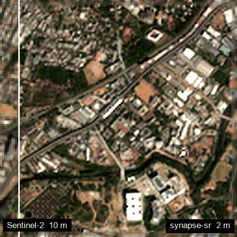

<p align="center">
  
  
</p>

**synapse-sr** turns a Sentinel-2 L2A scene into a 2.0 m red, green, blue and near-infrared product. The output
stays consistent with what the satellite actually measured.

<p align="center">
  
  <br><em>RV University, Bengaluru. Sentinel-2 L2A, 6 February 2025, left: 10 m input, right: synapse-sr output.</em>
</p>

## Why synapse-sr

| | |
|---|---|
| **Observation-consistent by construction** | The network may only add structure the sensor could not see. Whatever Sentinel-2 did observe is pinned by a physical model of the instrument, so the output reproduces the input measurement. |
| **Accountable output** | Every result carries a per-pixel error-scale map, a support class (observation-determined versus prior-dominated), a validity mask and a measured round-trip consistency. |
| **Direct x5 to a 2 m grid** | One network, no chained x2 / x4 stages. The centre sub-pixel of each 10 m pixel sits on the source-pixel centre, and the output grid shares the input origin. |
| **Drop-in geospatial I/O** | GeoTIFF in, GeoTIFF out, with the CRS and bounds preserved. Arbitrary scene sizes are handled by seamless tiling, with NoData and cloud masking from the scene classification layer. |
| **Easy to use** | One call from Python or one command in the shell. It accepts numpy, torch or xarray inputs, and works fully offline once the weights are local. |

## In three lines

```python
import synapse_sr

result = synapse_sr.super_resolve("sentinel2_l2a.tif")
result.save("sentinel2_2m.tif")
```

```bash
synapse-sr sentinel2_l2a.tif sentinel2_2m.tif
```

Continue with [Installation](installation.md) and the [Quick start](quickstart.md).

!!! note "Grid spacing is not effective resolution"
    The output grid is 2.0 m. How fine a structure is genuinely resolved is a separate, measured property;
    see [Limitations](limitations.md).
